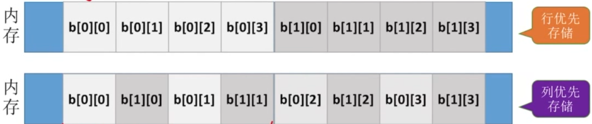
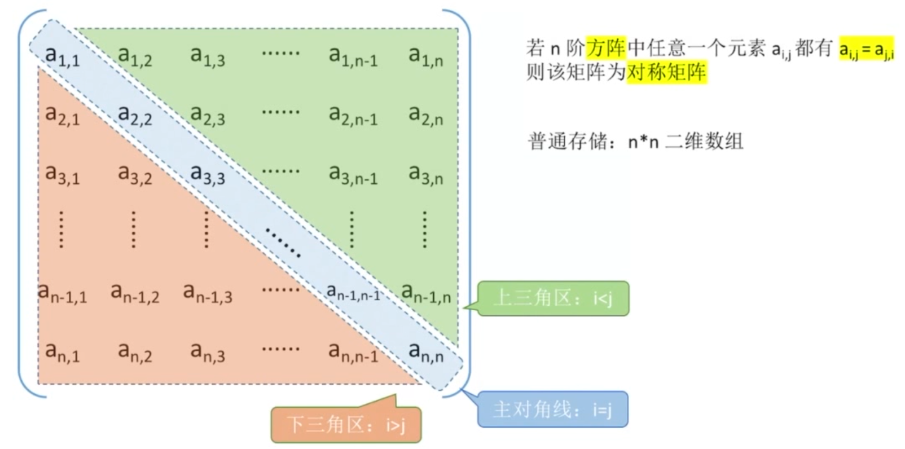
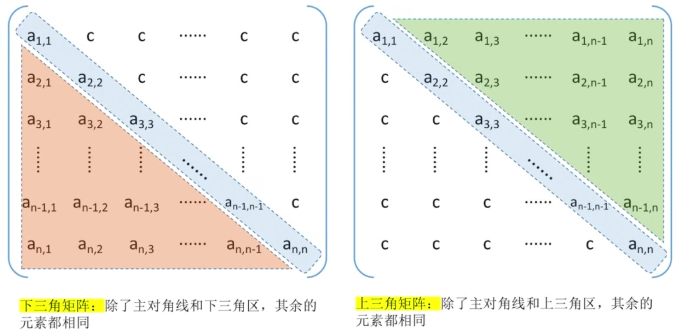
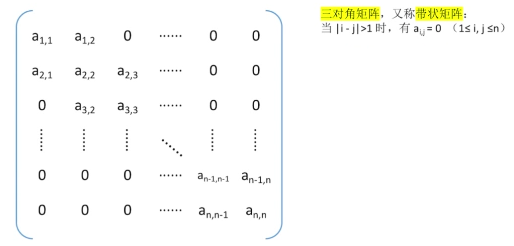
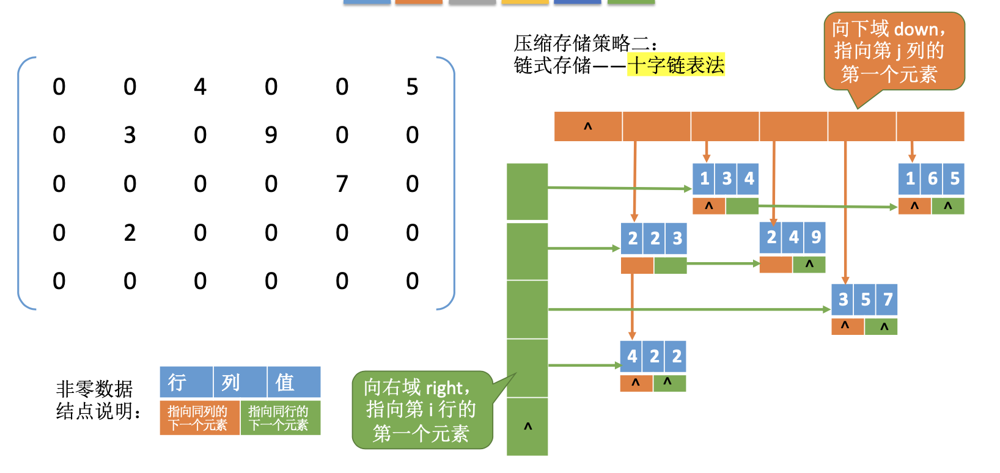

# DataStructureNotes
数据结构笔记  
This repository is created for revision and conclusion for data structure learning.  
这个仓库用于分享我在学习数据结构的笔记与总结的代码, 欢迎大家提出各种建议.
charles.shht@gmail.com
## 线性表

### 线性表文件夹中包含以下内容 

|                   |顺序表|  |链式储存|||||
|:-|:-:|-:|-:|-:|-:|-:|-:|
|                    |静态 |动态|单链表(头节点)|单链表(无头节点)|双链表|循环链表|静态链表|
|Define              |√   |√   |√           |√            |√    |√     |√      |
|InitList(&L)        |√   |√   |√           |√            |√    |√     |-      |
|Empty(L)            |-   |-   |√           |√            |-    |√     |-      |
|IsTail(&L,&Node)    |-   |-   |-           |-            |-    |√     |-      |
|Length(L)           |-   |-   |O(n)        |O(n)         |-    |-     |-      |
|IncreaseSize(&L,len)|-   |√   |-           |-            |-    |-     |-      |
|LocateElem(L,e)     |O(1)|O(1)|O(n)        |O(n)         |-    |-     |-      |
|GetItem(L,i)        |O(n)|O(n)|O(n)        |O(n)         |-    |-     |-      |
|ListInsert(&L,i,e)  |O(n)|O(n)|O(n)        |O(n)         |-    |-     |-      |
|InsertPoier(&L,e)   |-   |-   |O(1)        |O(1)         |-    |-     |-      |
|InsertNext(&L,e)    |-   |-   |O(1)        |O(1)         |√    |-     |-      |
|ListDelete(&L,i,&e) |O(n)|O(n)|O(n)        |-            |√    |-     |-      |
|DeleteNode(&N)      |-   |-   |O(1)        |O(1)         |-    |-     |-      |
|DestoryList(&L)     |-   |-   |O(n)        |O(n)         |-    |-     |-      |
|尾插法               |-   |-   |√           |√            |-    |-     |-      |
|头插法               |-   |-   |√           |√            |-    |-     |-      |

__√__: 可以实现.   
__O(..)__: 可以实现, 并写出了时间复度.  
__-__: 没有对应函数, 或尚未写出该函数.  

### 一些小点
1. 线性表包含顺序存储与链式存储. 顺序存储(顺序表)中又包含静态分配与动态存储. 
2. 单链表不带头节点的按位插入操作, 会比较麻烦, 一般都写带头节点的形式.
3. 单链表的前插法可以从后插法改编而成. 先后插再为原节点重新赋值, 达到与前插等效的目的.
4. 在初始化链表节点的时候, 养成Node.next=NULL的好习惯.
5. 链表头插法的策略常用于“链表逆置”.
6. 循环单链表不一样的地方就是初始化的时候next指向自己```L->Next==L;L->Primer==L```
7. 思考各种链表如何判空, 如何判断在表头或表尾, 如何在表头表中表尾增删元素有无特殊处理.
8. 静态链表由[数组+游标]组成, 游标中存放下一个元素的下标, 最后一个节点下标是-1.

### 顺序表与链表对比
#### 逻辑结构
都是线性表
#### 储存结构
顺序表 - 随机存取, 存储密度高, 但是分配空间与扩容不方便.
链表 - 分配空间与扩容方便, 存储密度低, 查找麻烦(不能随机存取).
#### 数据运算
__创建__ -  顺序表分一整片, 过小不好扩容, 过大浪费空间; 链表分配扩展空间容易.  
__销毁__ - 链表依次free各个节点; 顺序表修改length=0(静态分配的回收空间由系统进行, 动态分配的回收空间需要手动free).  
__增删__  - 顺序表需要前后移动O(n), 链表也是O(n),时间开销来自查找元素n. 不过寻找带来的时间开销比移动元素快得多, 所以还是
 链表效率更高.  
__改查__  - 顺序表按位查找O(1),安置查找如果顺序表元素无序O(n),有序可以优化算法; 
  链表无论有序无序, 都是O(n).
#### 总结
顺序表适合查, 链表适合动态分配与增删.  

## 栈与队列
### 栈与队列文件夹中包含下面内容 

|          |顺序栈(数组)|共享栈(数组)|链栈|
|:-|:-:|:-:|:-:|
|Define           |√         |√   |√  |
|InitStack(&S)    |√         |√   |√  |
|DestroyStack(&S) |-         |-   |-  |
|Push(&S,x)       |√         |-   |√  |
|Pop(&S)          |√         |-   |√  |
|GetTop(S,&x)     |√         |-   |√  |
|Empty(S)         |√         |-   |√  |

| 队列的基本操作           |顺序|链试|双端队列|
|:-|:-:|:-:|:-:|
|Define           |√         |√    |-|
|InitQueue(&Q)    |√         |√    |-|
|DestroyQueue(&Q) |-         |-    |-|
|EnQueue(&Q,x)    |√         |√    |-|
|DeQueue(&Q,&x)   |√         |√    |-|
|GetHead(Q,&x)    |√         |√    |-|
|Empty(Q)  [爱考]  |√         |√    |-|

| 应用 |栈|队列|
|:-|:-:|:-:|
|   |括号匹配验证| 
|   |中缀转后缀|
|   |中缀转前缀|
|   |后缀表达式计算|
|   |前缀表达式计算|

__√__: 可以实现.   
__O(..)__: 可以实现, 并写出了时间复度.  
__-__: 没有对应函数, 或尚未写出该函数.  

### 笔记总结
#### 栈的定义
1. 只允许在一端进行插入或删除的线性表; 栈顶, 栈底, 空栈.  
2. 基本操作: 创,增,删,查,判空,(判满).
3. 先进后出(LIFO)  -Last in First out
4. n个元素进栈, 出栈的种类$\frac{C_{2n}^{n}}{n+1}$
5. 共享栈, 两头两个栈.

#### 队列的定义
1. 只允许在一端插入, 另一端删除.
2. 先进先出(FIFO) - First in First out
3. 基本操作: 创,增,删,查.
4. Q.front指向队头元素, 队尾指针指向下一个要插入的元素.
5. 注意判满操作: ```(Q.rear+1)%MaxSize  == Q.front;```
6. 注意判空操作: ```Q.front == Q.rear;```
7. __队头队尾指针意义__: 1. 队尾指针可能指向下一个要插入的元素(上述叙述), 2. 也可以能指向最后一个内容, 考试时要注意.
8. 三种 __实现方案__: a. 牺牲一个存储空间(5和4). b. 增加size元素记录队列长度. c. 增加tag = 0/1, 标记最近一次操作是出队还是入队.
9. __重要操作__: 如何初始化, 入队, 出队, 判空, 判满, 计算队列长度.
10. 分别思考: (8和9的组合) - 1a,1b,1c,2a,2b,2c.
11. 队满问题在链式存储中不用考虑.
12. __双端队列__: 只允许从两端插入、两端删除的线性表.  另外还可以有 __输入受限的双端队列__ 和 __输出受限的双端队列__ . 喜欢考察输入徐序列的合法性.

#### 栈的应用
__括号匹配问题__ 
遇到左括号就入栈, 遇到右括号就出栈.
__表达式求值__ 
考点: 中缀表达式, 前缀表达式(波兰式), 后缀表达式(逆波兰试).  
后缀表达式相关考点: 中缀转后缀, 后缀求值
前缀表达式相关考点: 中缀转前缀, 前缀求值
例题:
中缀:
( (15 / ( 7 - ( 1 + 1 ) ) ) * 3 ) - ( 2 + ( 1 + 1 ) )
------3----2----1------4----7----6----5---(左优先)  
------5----4----3------6----7----2----1---(右优先)  

前缀:
\+ 1 1  
\- 7 \+ 1 1  
/ 15 \- 7 \+ 1 1  
\* / 15 \- 7 \+ 1 1 3  
\- \* / 15 \- 7 \+ 1 1 3 + 2 + 1 1  
7-6-5--4---3-------2---1-----(右优先)   
对应算法: 从 __右往左__ 扫描,  每遇到一个操作符就让前边两个数先计算, 再把结果压回栈中. 先弹出的是 __左__ 操作数, 后弹出的是 __右__ 操作数. 

后缀 __[重点]__
1 1 +
7 1 1 + -
15 7 1 1 + - /
15 7 1 1 + - / 3 *
15 7 1 1 + - / 3 * 2 1 1 + + -
---------1-2-3--4-------5-6-7-(左优先)
对应算法: 从 __左往右__ 扫描,  每遇到一个操作符就让前边两个数先计算, 再把结果压回栈中. 先弹出的是 __右__ 操作数, 后弹出的是 __左__ 操作数.

中缀转后缀
1. 遇到操作数 ->加入后缀表达式
2. 遇到‘(’入栈, 遇到‘)’依次弹出站内运算符加入后缀表达式直到‘(’. (注意, 括号不入后缀表达式)
3. 遇到运算符.  依次弹出运算及高于或等于当前运算符的所有运算符, 直到括号或栈空为止. 然后把当前运算符入栈. 
4. 处理完所有字符后, 把栈中运算符依次弹出.  
__出题: 转换到某一步时,  栈里边的情况.__

中缀表达式计算 - 把中缀转后缀与后缀计算合二为一
两个栈 - 运算符栈(中缀转后缀使用), 操作数栈(后缀计算用). 每弹出一个运算符, 操作数栈就进行一次计算. 

#### 队列的应用
__树的层次遍历__
每次处理从队列头开始, 处理每个节点时, 如果有孩子节点插入好队列末尾.
__图的广度优先遍历__
__操作系统中的FCFS(先来先服务)__

### 特殊矩阵的存储
一维矩阵, 二维矩阵, 对称矩阵, 三角矩阵, 三对角矩阵, 稀疏矩阵.
__一维数组__ - 随机存储
已知开始地址,  可以通过sizeof计算出每一个元素的位置.
__二维数组__ - 随机存储
行优先, 列优先
  

__对阵矩阵__
可以存储上三角区+主对角线 / 下三角区+主对角线
数组需要存储  (1+n)n/2个元素
出题方法: 储存上三角?下三角?行优先?列优先?矩阵元素下标从0/1开始? 数组下标从0/1开始? Aij的地址?
  

__三角矩阵__
数组需要存储  (1+n)n/2 + 1 个元素


__三对角矩阵__
第k+1个元素在第i行第j列?
$3(i-1)-1 ≤ k < 3i-1 \\ i ≤ \frac{k+1}{3}+1 \\ i=[\frac{k+1}{3}+1] $
$k = 3(i-1)-1+(j-i+1) = 2i + j - 3$
从而可以求出i与j


__稀疏矩阵__
非零元素远远少于0元素.
方法一: 定义一个三元组去存储<行号,列号, 值> - 失去随机存储特性
方法二: 十字链表法


